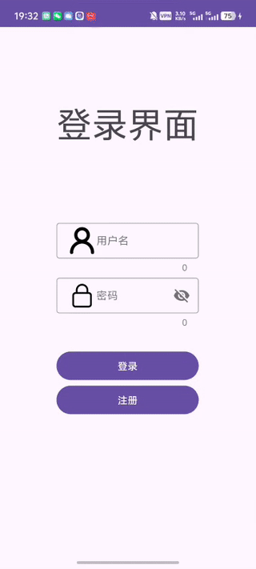
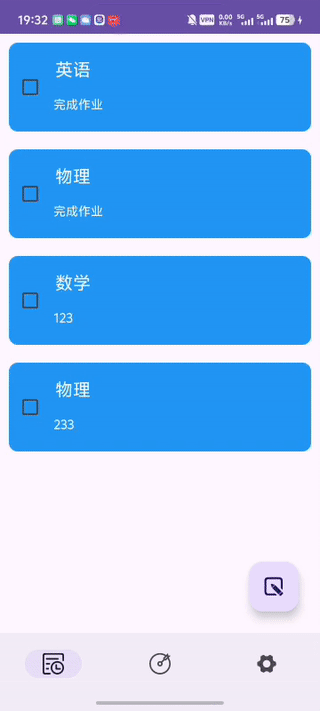
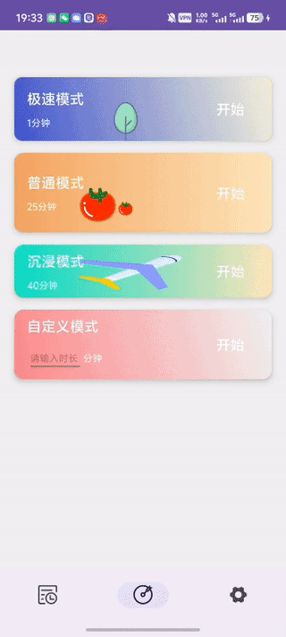

🌟 五一考核待办事项 App

> 一个基于 Kotlin + MVVM 架构开发的简洁高效的待办事项类 Android App。功能包括用户登录、待办管理、番茄钟，以及数据持久化和流畅交互体验。

---

## 📱 App 功能介绍

### 🔐 登录模块
- 使用 Room 数据库实现本地用户数据隔离管理
- 支持注册 & 登录功能
- 简洁美观的 UI 设计，提升使用体验

### ✅ 待办页面
- 使用 `FloatingActionButton` 添加任务
- 勾选任务自动标记完成并移至列表底部
- 长按任务拖动改变顺序
- 左滑任务实现删除操作

### ⏰ 番茄钟页面
- 支持默认倒计时番茄钟
- 支持用户自定义时长设定
- 专注时间管理，提升工作效率

### 🔁 页面导航
- 使用 `BottomNavigationView` 实现三个 Fragment 切换：
  - 登录页
  - 待办事项页
  - 番茄钟页

---

## 🧩 技术栈

| 技术       | 说明                            |
|------------|---------------------------------|
| Kotlin     | 主体编程语言                    |
| Room       | 本地数据库框架，用于用户与任务存储 |
| MVVM       | 架构模式，使用 ViewModel + LiveData |
| RxJava     | 异步处理，提高响应流畅性         |
| Jetpack    | 使用 Fragment + ViewModel 等组件 |
| Material Design | 提供现代化 UI 控件支持       |

---

## 💡 使用亮点

- 🧠 MVVM 架构，逻辑分层清晰，易于扩展
- 🗃 Room 实现本地数据持久化，支持多用户
- 🔁 RecyclerView + ItemTouchHelper 实现拖动排序与滑动删除
- ⏳ 自定义番茄时钟功能辅助专注工作

---

## 心得体会
五天的时间，说长不长，说短也不短。刚接手项目的那一刻，那种不知所措的感觉仿佛还在身边盘旋。MVVM 架构要怎么搭建？Room 数据库该从何入手？Model 和 Activity 各自该承载哪些数据？它们之间的通信逻辑该如何构建？我一个人、一台电脑，坐在书桌前翻资料、查源码、对着一屏幕的红字发呆，脑子一团浆糊，但又不得不逼着自己冷静下来。

最开始，我天真地以为寒假的积累已经足够支撑我从容应对这次五一的项目考核，但真正下场写代码的那一刻，才意识到——技术的世界远没有想象中那样线性清晰。项目初始化阶段光是配置环境就卡了半天，Room 数据库连建个表都能整出一堆报错，MVVM 的数据流动像迷宫一样晕头转向，viewModel 和 repository 的职责划分让我反复推敲。点击一个按钮，页面一片爆红；写好一段逻辑，调试时却总是跳转失败。那种崩溃感，就像自己辛辛苦苦搭起的积木突然被一巴掌拍散了。

可就在这样的混乱中，我学会了一个又一个技术的“为什么”和“怎么样”。我学会了用 log 去一点一点分析逻辑的走向。每一个小 bug 被解决的瞬间，都是我与项目渐渐建立起默契的过程。

是啊，过程很苦，很孤独，也很琐碎，但每一次熬夜调试、每一次重启设备、每一次自我怀疑后坚持再看一眼代码的那份执拗，都是我正在成长的证据。

现在的我，虽然还不能说完全掌控整个项目，但相比五天前那个满脑子问号的自己，我已经能清晰地画出架构的轮廓，能熟练地在 model 和 UI 层之间传递数据，也能更有信心地面对接下来的每一次未知。
## 📷 项目截图
-
 登录界面

-
 添加任务界面
 
-
  自定义番茄钟界面
 
-

